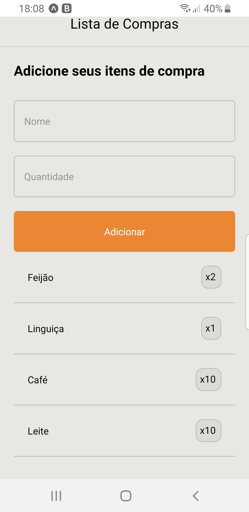

# APP LISTA DE COMPRAS
<h1 align="center">
   
  
</h1>

## :blush: **Descrição**

APP LISTA DE COMPRAS é um aprendizado em React Native, utilizando-se do emulador EXPO para composição de uma lista básica de compras, aonde é informado ítem & quantidade.

## :dizzy: **Roteiro**

** Checklist **
Certifique-se de possuir as bibliotecas abaixo, caso contrário execute a instalação com comando abaixo:

1.	npm install --global expo-cli
2.	expo init 'nome do projeto'
3.	npm install no console IDE caso falte alguma dependência

## :zap: **Tecnologia**

 
 
